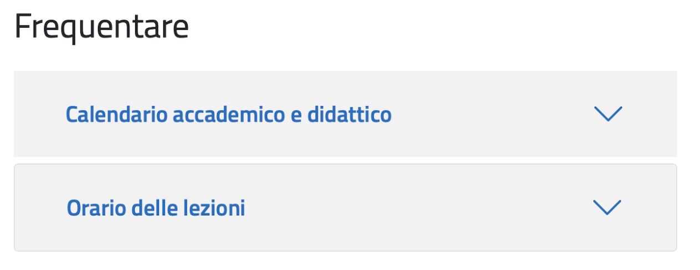
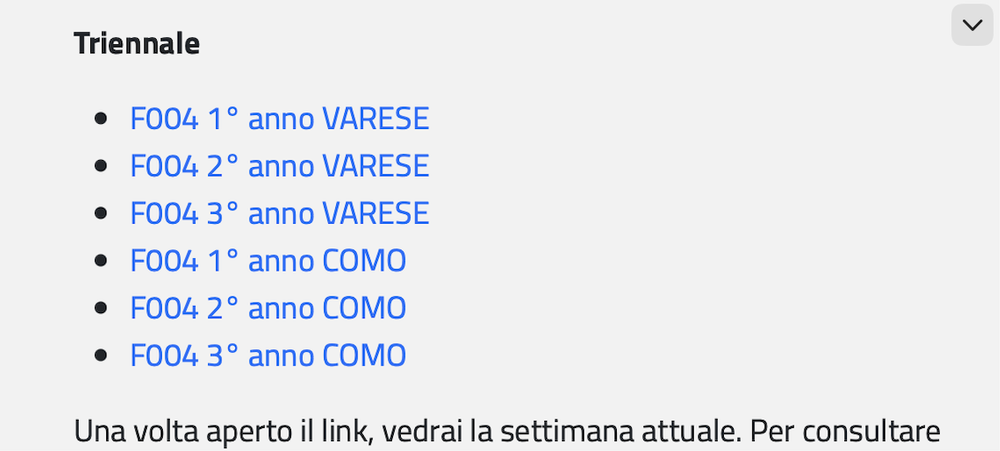
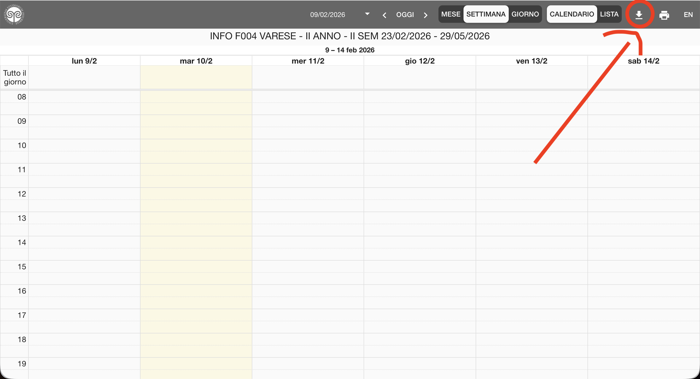
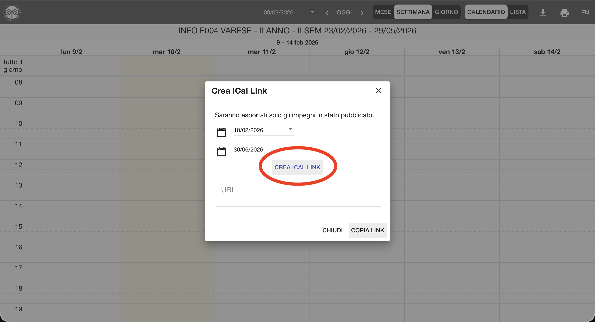

# Calendario Uninsubria Informatica - Filtro Personalizzato

Questo repository ospita un sistema automatizzato per filtrare il calendario delle lezioni del corso di laurea in Informatica (Università degli Studi dell'Insubria).

Il sistema risolve il problema del calendario ufficiale "affollato", generando un file `.ics` pulito che contiene solo i corsi che ti interessano, rimuovendo automaticamente le materie non frequentate o gli esami già sostenuti.

## Come funziona

A causa delle restrizioni di sicurezza dei server universitari (Firewall/Geoblocking che bloccano i server cloud come GitHub Actions), l'aggiornamento avviene tramite un flusso locale:

1 **Mac/PC Locale**: Uno script viene eseguito automaticamente ogni 3 ore (tramite cron).

2 **Download & Filtro**: Scarica l'orario ufficiale dall'ateneo e rimuove le materie escluse (configurate in Python).

3 **Deploy**: Carica il file aggiornato (`custom_uni_calendar.ics`) su questo repository GitHub.

4 **Sync**: I dispositivi (iPhone, iPad, Mac, Android) leggono il file direttamente da GitHub, che funge da hosting sempre disponibile.

## Link per l'iscrizione (Per questo calendario)

Se le materie filtrate in questo repository coincidono con le tue, puoi aggiungere direttamente questo calendario al tuo dispositivo:

URL Calendario:

[https://raw.githubusercontent.com/itsvise/calendario-uninsubria-informatica/main/custom_uni_calendar.ics](https://raw.githubusercontent.com/itsvise/calendario-uninsubria-informatica/main/custom_uni_calendar.ics)


## Come aggiungerlo:

- iPhone/iPad: Impostazioni > Calendario > Account > Aggiungi account > Altro > Aggiungi calendario iscritto.

- Mac: App Calendario > File > Nuova iscrizione a calendario.

- Google Calendar: Icona "+" > Da URL.

## Tutorial: Crea il TUO calendario personalizzato

Sei uno studente e vuoi usare questo sistema per il tuo piano di studi specifico? Segui questa guida.

1. **Copia il progetto (Fork)**

Fai il Fork di questo repository (tasto in alto a destra su GitHub) per crearne una copia sul tuo profilo.

2. **Clona sul tuo computer**

Apri il terminale e scarica la tua copia (sostituisci `TUO_USERNAME`):

```bash
git clone [https://github.com/TUO_USERNAME/calendario-uninsubria-informatica.git](https://github.com/TUO_USERNAME/calendario-uninsubria-informatica.git)
cd calendario-uninsubria-informatica
```

3. **Scegli le materie da nascondere**

Apri il file `filter_calendar.py` con un editor di testo.
Modifica la lista `MATERIE_DA_RIMUOVERE` inserendo i nomi (o parti dei nomi) dei corsi che NON vuoi vedere.

```python
MATERIE_DA_RIMUOVERE = [
    "BASI DI DATI II",
    "MODELLI INNOVATIVI PER LA GESTIONE DEI DATI",
    "PROGRAMMAZIONE PROCEDURALE E AD OGGETTI"
]
```

*Nota: Le materie NON presenti in questa lista verranno mantenute.*

4. **Configura lo script di aggiornamento**

Nella cartella trovi un file `aggiorna_template.sh`.

1. Rinominalo in `aggiorna.sh`.

2. Aprilo e inserisci il tuo link iCal (preso dal portale studenti Uninsubria) al posto di `INSERISCI_QUI....`.

---
<details>
<summary><strong>❓ Come ottengo il mio Link iCal? (Clicca qui)</strong></summary>

1. Vai sul portale University Planner dell'Insubria (es. informatica: https://www.uninsubria.it/formazione/offerta-formativa/corsi-di-laurea/informatica   ).

2. Vai alla sezione “Frequentare” -> “Orario delle lezioni”.
()

3. Troverai dei link, premi sull’anno a Varese:
()

4. Premi l’icona con la freccia verso il basso in alto a destra
()

5. Premi il tasto “CREA ICAL LINK” per generare il link ical
()

6. Premi il tasto “COPIA LINK” per copiare il link ical generato (inizia con https://unins.prod.up.cineca.it/...).
()

</details>

---

3. Rendilo eseguibile:

```bash
chmod +x aggiorna.sh
```

*Nota: Il file `aggiorna.sh` è ignorato da Git (`.gitignore`) per proteggere la tua privacy. Il tuo link personale non finirà mai online.*

5. **Installa i requisiti**

```bash
pip install -r requirements.txt
```

6. **Attiva l'automazione (Mac/Linux)**

Per aggiornare il calendario ogni 3 ore, useremo **cron**.
Da terminale digita `env EDITOR=nano crontab -e` e aggiungi questa riga in fondo (modifica il percorso con quello della tua cartella):

```bash
0 */3 * * * /Users/TUO_NOME/Documents/GitHub/calendario-uninsubria-informatica/aggiorna.sh >> /tmp/calendar.log 2>&1
```

## Come rimuovere tutto (Disinstallazione)

Se hai finito il semestre o non vuoi più usare il servizio, ecco come pulire tutto:

1. Ferma l'automazione:

- Apri il terminale: `env EDITOR=nano crontab -e`
- Cancella la riga relativa a `aggiorna.sh`.
- Salva (`CTRL+O`) ed esci (`CTRL+X`).

2. Rimuovi i file: Cancella la cartella del progetto dal tuo computer.

3. Rimuovi dal telefono: Vai nelle impostazioni del calendario del tuo telefono ed elimina l'iscrizione/account.

4. GitHub (Opzionale): Puoi cancellare il repository dalle impostazioni di GitHub.

## Requisiti Tecnici

- **Python 3.9+**

- **Librerie**: `ics`, `requests`

- **SSL Fix**: `urllib3<2.0` (Necessario per evitare errori SSL su macOS con LibreSSL).

## Licenza

Questo progetto è distribuito sotto licenza MIT. Vedi il file [LICENSE](LICENSE) per i dettagli.
